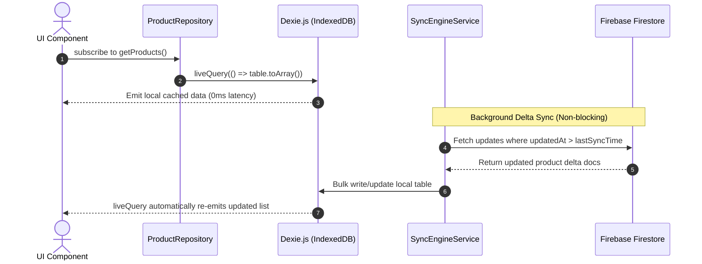
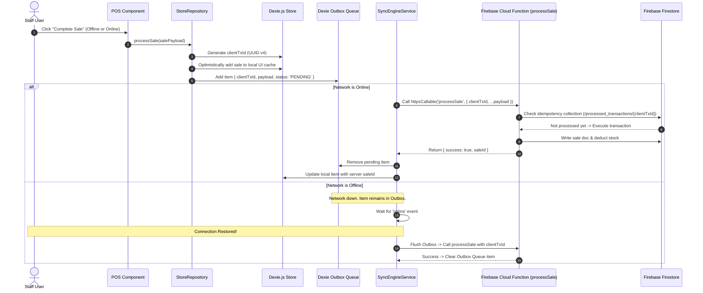
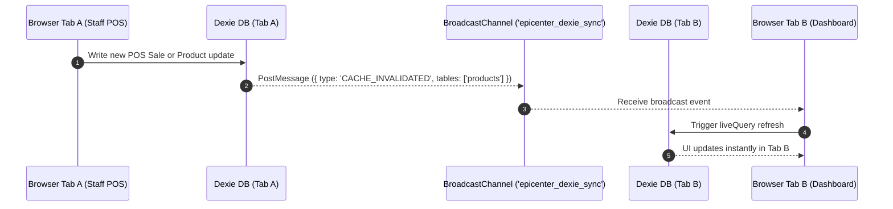

# Workflow & Sequence Diagrams (Dexie.js + Firestore Sync)

> **Document Part:** 7 of 7  
> **Topic:** Visual Sequence Diagrams for Data Read, Offline Write, and Sync Workflows  

---

## 1. Cache-First Read Workflow

---

## 2. Offline Mutation & Outbox Sync Workflow

---

## 3. Multi-Tab Synchronization Workflow

