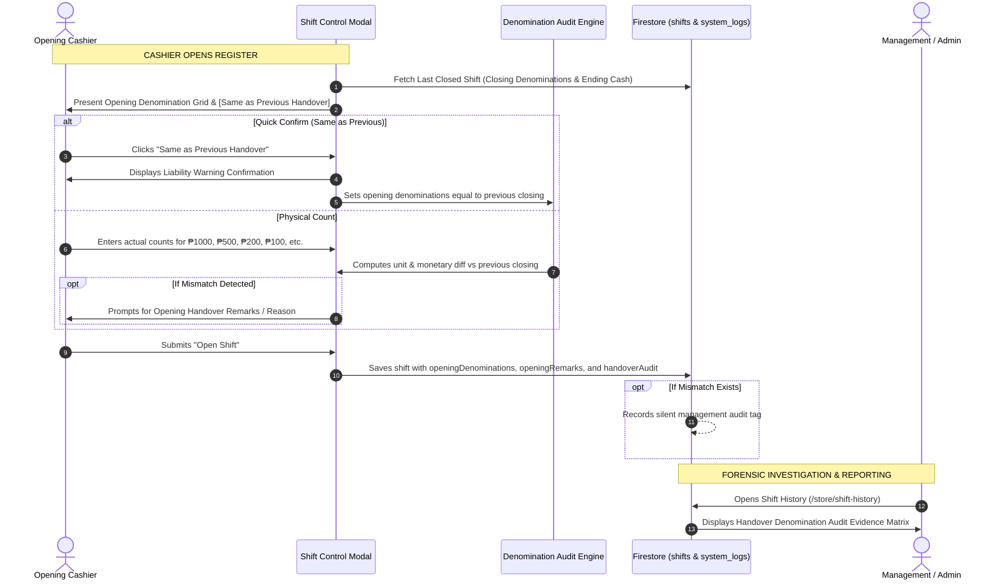

# Shift Handover Denomination Audit & Forensic Evidence Specification

## 1. Overview
In gym POS operations, the physical cash left in the drawer at the closing of Shift (N-1) serves as the starting cash float for the opening of Shift N. 
This specification implements:
1. **Interactive Opening Denomination Breakdown & Quick Confirm**: Cashier can physically count bills and coins or click **`[📋 Same as Previous Handover]`** with an explicit **Cashier Liability Warning**.
2. **Denomination-Level Handover Comparison & Mismatch Tracking**:
   - Evaluates unit count and monetary difference per denomination between **Previous Shift Close** and **Current Shift Open**.
   - Handles **Denomination Reallocation** (Total drawer amount matches, but individual bill counts differ — e.g. someone broke a ₱1,000 bill into two ₱500s).
   - Handles **Handover Variance** (Total starting cash does not match previous closing cash).
3. **Handover Remarks & Silent Management Audit**:
   - Captures opening cashier remarks for any mismatch.
   - Logs silent audit records for administrative review.
4. **Forensic Evidence Matrix in Cash Reports & Shift History (`/store/shift-history`)**:
   - Visual side-by-side comparison table showing: Denomination | Previous Close Count | Current Open Count | Unit Diff | Subtotal Diff | Opening Remarks.

---

## 2. Shift Handover Verification Sequence



---

## 3. Data Schema Additions

### 3.1. `src/app/core/models/cash-register.model.ts`
```typescript
export interface DenominationAuditDiffItem {
  denomination: number;
  label: string;
  type: 'BILL' | 'COIN';
  prevCount: number;
  openCount: number;
  unitDiff: number;       // openCount - prevCount
  prevSubtotal: number;
  openSubtotal: number;
  valueDiff: number;      // openSubtotal - prevSubtotal
  isMatched: boolean;
}

export interface HandoverDenominationAudit {
  status: 'PERFECT_MATCH' | 'DENOM_REALLOCATION' | 'CASH_MISMATCH' | 'INITIAL_SHIFT' | 'MANUAL_OVERRIDE';
  isTotalMatched: boolean;
  isDenomMatched: boolean;
  previousClosingCash: number;
  openingCash: number;
  cashVariance: number;
  prevShiftId?: string;
  prevShiftClosedBy?: string;
  openingRemarks?: string;
  diffItems: DenominationAuditDiffItem[];
  recordedAt: Date;
}

export interface ShiftSession {
  // Existing fields...
  openingDenominations?: DenominationBreakdown | null;
  closingDenominations?: DenominationBreakdown | null;
  isManualOpeningCountOverride?: boolean;
  isManualClosingCountOverride?: boolean;
  
  // Handover Audit Evidence
  openingRemarks?: string;
  handoverAudit?: HandoverDenominationAudit | null;
}
```

---

## 4. Handover Status Definitions

1. 🟢 **`PERFECT_MATCH` (Balanced Handover)**:
   - Every individual bill and coin denomination matches 1-to-1 ($unitDiff = 0$ for all denominations), and total starting cash equals previous ending balance.
2. 🟡 **`DENOM_REALLOCATION` (Total Match, Denomination Swapped)**:
   - Total starting cash equals previous ending balance ($cashVariance = 0$), but individual bill/coin counts differ (e.g. -1 ₱1,000 bill, +2 ₱500 bills). Logged silently as potential change-making / swap evidence.
3. 🔴 **`CASH_MISMATCH` (Drawer Shortage / Overage)**:
   - Total starting cash does not equal previous ending balance ($cashVariance != 0$). High-priority audit flag for investigation.
4. ⚪ **`INITIAL_SHIFT` / `MANUAL_OVERRIDE`**:
   - First shift in system or cashier skipped denomination breakdown via manual lump-sum override.

---

## 5. UI Elements

1. **Shift Control Modal (Open Mode)**:
   - **`[📋 Same as Previous Handover]`** button with instant auto-fill.
   - **Liability Warning Card**:
     > ⚠️ *Liability Confirmation: You confirm drawer cash matches the previous shift handover of ₱X,XXX.XX. You are held responsible if discrepancies are discovered later.*
   - Denomination Calculator Grid with live comparison against previous shift closing.
   - **Opening Remarks Input**: Triggered when any count or total variance is detected.
2. **Shift History (`/store/shift-history`) Drawer**:
   - **Handover Denomination Audit Evidence Matrix**: Interactive table showing Prev Close Count, Open Count, Unit Diff, and Subtotal Diff.
   - **Handover Status Chip**: Color-coded badge (`PERFECT_MATCH`, `DENOM_REALLOCATION`, `CASH_MISMATCH`).
   - **Cashier Remarks**: Quote card showing opening cashier's notes at the time of opening.
