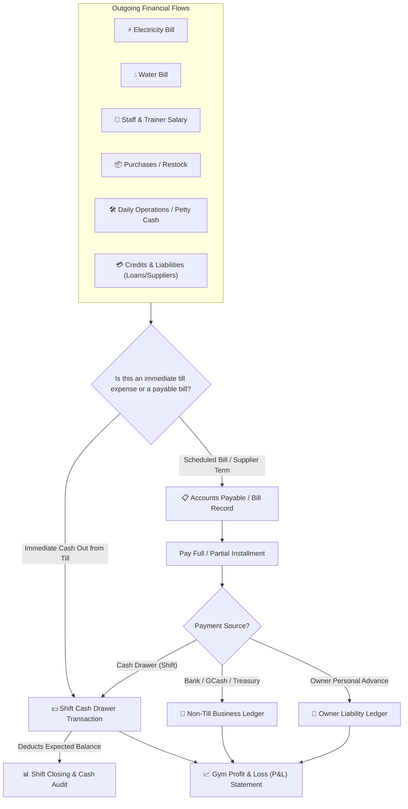

# Outgoing Financial Flows & Accounts Payable (AP) System Specification

## 1. Executive Summary
Epicenter Gym handles multiple distinct types of financial outflows:
1. **Electricity Bill** (Recurring monthly utility, variable amount, strict due date)
2. **Water Bill** (Recurring monthly utility, meter/consumption tracking, due date)
3. **Salary & Payroll** (Staff wages, trainer commissions, staff advances/vale deductions)
4. **Purchases** (Store inventory, gym equipment, maintenance supplies)
5. **Operating Expenses (OPEX)** (Daily petty cash, drinking water refilling, gym repairs)
6. **Credits & Liabilities** (Supplier credit terms e.g. 30-day payables, owner capital advances, loans)

This document establishes the architecture for categorizing, tracking, and auditing these outflows while distinguishing between **Cash Drawer (Till) Outflows** and **Company / Bank Treasury Outflows**.

---

## 2. Core Architectural Framework



---

## 3. Data Models & Enums

### 3.1. Outflow Category Enum
```typescript
export type OutflowCategory =
  | 'UTILITY_ELECTRICITY'  // Electricity Bill (Meralco / Provider)
  | 'UTILITY_WATER'        // Water Bill (Maynilad / Provider)
  | 'UTILITY_INTERNET'     // Internet & Telco
  | 'SALARY_STAFF'         // Front desk & gym staff wages
  | 'SALARY_COMMISSION'    // Personal trainer commissions
  | 'SALARY_ADVANCE'       // Staff Cash Advance (Vale)
  | 'PURCHASE_INVENTORY'   // Retail products, drinks, supplements
  | 'PURCHASE_EQUIPMENT'   // Gym weights, machines, accessories
  | 'EXPENSE_MAINTENANCE'  // Equipment repair, facility fixes
  | 'EXPENSE_SUPPLIES'     // Cleaning agents, sanitation, drinking water refill
  | 'EXPENSE_MISC'         // General petty cash expenses
  | 'LIABILITY_SUPPLIER'   // Supplier credit / Accounts Payable payment
  | 'LIABILITY_LOAN'       // Debt service / Loan repayment
  | 'LIABILITY_OWNER';     // Owner advance repayment / Drawings
```

### 3.2. Payment Source Enum
```typescript
export type OutflowPaymentSource =
  | 'DRAWER_CASH'      // Taken physically from active shift register
  | 'BANK_TRANSFER'    // Paid via BDO/BPI/Bank corporate account
  | 'GCASH_BUSINESS'   // Paid via Gym GCash Merchant/Wallet
  | 'OWNER_ADVANCE';   // Paid out-of-pocket by Owner (increases gym liability to owner)
```

### 3.3. Bill & Accounts Payable Model (`BillPayable`)
```typescript
export type BillStatus = 'UNPAID' | 'PARTIALLY_PAID' | 'PAID' | 'OVERDUE' | 'CANCELLED';

export interface BillPaymentRecord {
  id: string;
  amount: number;
  paymentDate: Date;
  paymentSource: OutflowPaymentSource;
  recordedBy: string;
  shiftId?: string;           // Populated if paid from a shift drawer
  referenceNumber?: string;   // GCash Ref / Bank Tx ID / Check No.
  receiptImageUrl?: string;
  notes?: string;
}

export interface BillPayable {
  id?: string;
  title: string;              // e.g. "Meralco Bill - August 2026"
  category: OutflowCategory;
  billerOrSupplier: string;   // e.g. "Meralco", "Maynilad", "WheyKing Nutrition"
  invoiceNumber?: string;
  billingPeriodStart?: Date;
  billingPeriodEnd?: Date;
  dueDate: Date;
  totalAmountDue: number;
  totalAmountPaid: number;
  remainingBalance: number;
  status: BillStatus;
  notes?: string;
  attachmentUrl?: string;     // Bill photo / scan
  payments: BillPaymentRecord[];
  createdAt: Date;
  createdBy: string;
  updatedAt: Date;
}
```

---

## 4. UI & Functional Modules

### Feature 1: Enhanced Cash Management Form (`/store/cash`)
When staff clicks **Add Expense** or **Cash Out / Remit**:
1. **Category Dropdown**: Pre-grouped categories (Utilities, Purchases, Maintenance, Salary Vale, Remittances).
2. **Recipient / Payee**: Free-text field for who received the money.
3. **Optional Bill Association**: Option to link the payment to an existing unpaid utility bill or supplier invoice.
4. **Receipt Photo Attachment**: Optional capture via tablet/phone camera.

### Feature 2: Dedicated Bills & Liabilities Tracker (`/store/payables` or `/finance/bills`)
1. **KPI Cards**:
   - `Total Unpaid Bills` (₱ Amount)
   - `Due in Next 7 Days` (Count & Amount)
   - `Overdue Bills` (Amber/Red Alert)
   - `Monthly Total Outflows Paid`
2. **Bill Management Table**:
   - Filter by Category (`Electricity`, `Water`, `Suppliers`, `Salaries`, `Loans`).
   - Filter by Status (`Unpaid`, `Partially Paid`, `Paid`).
   - Quick action: **"Record Payment"** (Allows partial or full settlement).
3. **Bill Creation Modal**:
   - Title, Category, Biller/Supplier Name, Total Amount, Due Date, and optional Bill Photo.

---

## 5. Safety & Non-Breaking Design Guarantee
1. **Preserves Existing Shift Till Logic**: All existing cash drawer calculations, opening/closing balances, denomination counters, and shift history remain 100% compatible.
2. **Zero Breaking Changes**: Shift sessions continue reading standard `CashTransaction` arrays.
3. **Audit Trails**: Every bill payment and drawer expense tracks `performedBy`, timestamps, and payment sources.
