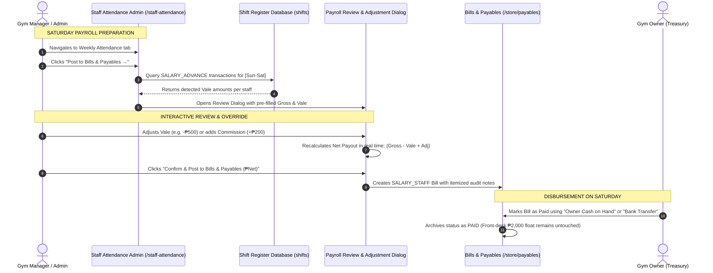

# Weekly Saturday Payroll Review, Vale Deductions & Adjustment Wizard Specification

## 1. Executive Overview
This specification details the **Weekly Saturday Payroll Review & Adjustment Wizard** in `/staff-attendance`. It bridges weekly attendance timesheets with **Bills & Payables** (`/store/payables`), enabling managers to inspect computed gross pay, auto-detect or manually deduct **Vale (Cash Advances)** taken from the shift drawer, apply bonuses/commissions, and post an audited net salary bill without distorting the front-desk ₱2,000 baseline cash float.

---

## 2. Operational Workflow & Architecture

---

## 3. Data Structure & Formulas

### 3.1. Net Compensation Formula per Staff
$$\text{Net Payout} = \text{Base Gross Pay} - \text{Vale Deduction} + \text{Bonuses/Adjustments}$$

### 3.2. Batch Totals Formula
$$\text{Total Net Payable} = \sum \text{Included Staff Net Payouts}$$
$$\text{Total Vale Deductions} = \sum \text{Included Staff Vale}$$

---

## 4. Pre-Posting Review Modal Fields
* **Employee Selection**: Checkbox to include/exclude individual staff.
* **Base Gross Pay**: Derived from Sunday-to-Saturday timesheet attendance ($(\text{Days Present} \times \text{Daily Rate}) - \text{Deductions} + \text{OT}$).
* **Vale (Cash Advance)**: Pre-populated with shift drawer advances taken during that week (editable).
* **Bonus / Other Adjustments**: Input for trainer sales commissions, meal allowance, or uniform fees.
* **Reason / Note**: Explanation tag for adjustments.
* **Calculated Net Payout**: Real-time calculated final payout per staff member.
