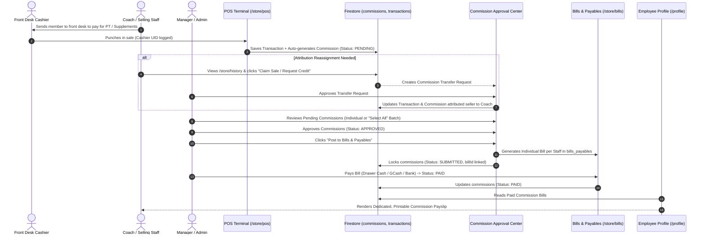

# Architecture & Functional Specifications: Product Commission & Attribution Transfer System

## 1. Executive Summary

This document specifies the end-to-end architecture and implementation plan for the **Epicenter Product Sales Commission System**. The system empowers gym coaches, trainers, and staff to earn sales commissions (% or flat ₱) on specific products, allows staff to claim or transfer sales attribution via an auditable manager approval queue, synchronizes historical sales reports, enables batch cash-out via individual bills in **Bills & Payables**, and issues separate, confidential **Sales Commission Payslips** in the employee profile.

---

## 2. Core Functional Requirements & Workflow



---

## 3. Data Models & Domain Architecture

### A. Product Model Extension (`src/app/core/models/store.model.ts`)
```typescript
export type CommissionType = 'PERCENTAGE' | 'FIXED' | 'NONE';

export interface Product {
  // ... existing fields ...
  commissionType?: CommissionType;      // 'PERCENTAGE' | 'FIXED' | 'NONE'
  commissionValue?: number;            // e.g. 10 (10%) or 100 (₱100.00/unit)
}
```

### B. Product Commission Model (`src/app/core/models/commission.model.ts`)
```typescript
export type CommissionStatus = 'PENDING' | 'APPROVED' | 'REJECTED' | 'SUBMITTED' | 'PAID';

export interface ProductCommission {
  id?: string;
  transactionId: string;
  transactionDate: Date;
  receiptNumber?: string;

  // Product Data
  productId: string;
  productName: string;
  productCategory?: string;
  unitPrice: number;
  quantity: number;
  subtotal: number;

  // Commission Calculations
  commissionType: 'PERCENTAGE' | 'FIXED';
  commissionRate: number;              // Rate applied (e.g. 10 or ₱50)
  commissionAmount: number;            // Net commission earned

  // Attribution
  sellerId: string;                    // Current credited staff UID
  sellerName: string;                  // Current credited staff name
  cashierId: string;                   // Terminal operator who processed sale
  cashierName: string;
  
  // Claim / Transfer State
  isClaimPending?: boolean;
  claimantStaffId?: string;
  claimantStaffName?: string;
  claimReason?: string;
  claimRequestedAt?: Date;

  // Sold To (Buyer Details)
  memberId?: string | null;
  memberName: string;                  // Member name or "Walk-in Guest"

  // Manager Approval Workflow
  status: CommissionStatus;
  reviewedBy?: string;                 // Manager UID
  reviewedByName?: string;
  reviewedAt?: Date;
  rejectionReason?: string;

  // Bills & Payables Integration
  billId?: string | null;              // Reference to bills_payables document
  submittedAt?: Date;
  submittedBy?: string;
  paidAt?: Date;
}
```

### C. Transaction Model Attribution Extension (`src/app/core/models/store.model.ts`)
```typescript
export interface Transaction {
  // ... existing fields ...
  cashierId?: string | null;           // Who operated POS
  cashierName?: string | null;
  attributedStaffId?: string | null;   // Selling staff (for sales reports)
  attributedStaffName?: string | null;
  hasCommission?: boolean;
  commissionIds?: string[];
}
```

---

## 4. Feature Specifications

### 1. Product Management (`/store/manage`)
* In `ProductFormDialog`:
  - Toggle / Select: **Sales Commission Type** (`None`, `Percentage %`, `Fixed Amount ₱`).
  - Number input: **Commission Value** (with `%` or `₱` prefix).
  - Clear hint: *"When sold at POS, this commission will be credited to the seller."*

### 2. POS Checkout & Attribution (`/store/pos`)
* In POS Checkout:
  - Defaults seller attribution to the logged-in staff / cashier.
  - Optional dropdown: **"Selling Staff / Coach"** (allows front desk to credit the coach directly at checkout).
  - Upon completing checkout, if any items have `commissionType !== 'NONE'`, atomically generates `commissions` documents in Firestore.

### 3. Sales History Claim & Transfer (`/store/history`)
* In `TransactionHistoryComponent`:
  - Each transaction displays:
    - Operator / Cashier Name
    - Attributed Seller Name
    - Commission indicator badge (`Commission Available`, `Claim Pending`, `Transferred`)
  - Any staff member can click **"Claim Sale / Transfer Commission"** on a transaction.
  - A modal opens asking:
    - Claimant staff name (auto-filled with logged-in user).
    - Note / Reason (e.g., *"I conducted the trial and closed the PT package with John Doe"*).
  - Once submitted, flags transaction and commission as `isClaimPending: true`.

### 4. Commission Command Center (`/store/commissions`)
*(Accessible by Managers and Admins)*
* **KPI Deck**:
  - `Pending Approval (₱ / Count)`
  - `Pending Attribution Claims (Count)`
  - `Approved Ready to Cash Out (₱ / Count)`
  - `Total Settled (Month)`
* **Tab 1: Commission Approval & Claims Queue**:
  - Checkboxes for single or **"Select All Pending"** batch actions.
  - Action buttons:
    - ✅ **Approve Selected (N)**
    - ❌ **Deny Selected (N)** (with modal to enter reason)
    - 🔄 **Review Attribution Claims** (Accept / Reject claim with reason)
  - Full details on each card/row:
    - Product Name & Category
    - Customer Name ("Whom it was sold to")
    - Sale Price & Date
    - Earned Commission
    - Seller vs Cashier
* **Tab 2: Cash Out to Bills & Payables**:
  - Grouping selector: **Group by Staff Member**.
  - Manager selects staff members and clicks **"Generate Individual Bills & Post to Payables"**.
  - Atomically creates one bill per staff in `bills_payables` with `category: 'SALARY_STAFF'`, subtype `'COMMISSION'`, linking all `commissionIds`.
  - Commission records are locked to status `SUBMITTED`. Once submitted, they can never be modified or deleted.
* **Tab 3: Cash Out & Payout History**:
  - Historical archive showing all past commission payout batches, linked Bill numbers, payment dates, and itemized receipts.

### 5. Staff Self-Service View (`/profile` or `/store/commissions` for staff)
* Staff members only see their own sales and commissions:
  - ⏳ **Pending Review**
  - 🟢 **Approved & Waiting Payout**
  - 📦 **Submitted to Payables**
  - ❌ **Denied** (with manager feedback)
  - Detail displays: Product sold, Date, Buyer name, Commission ₱.

### 6. Reports & Downstream Data Consistency (`/reports`)
* `ReportsService.getSalesAnalytics()`:
  - Updated to read `tx.attributedStaffName || tx.staffName`.
  - When an attribution claim is approved by a manager, the transaction's `staffName` and `attributedStaffName` are updated, ensuring that:
    - **Top Staff Sales leaderboard**
    - **Staff Performance analytics charts**
    - **Transaction History filters**
    instantly and accurately credit the true selling coach!

### 7. Dedicated Commission Payslips (`/profile`)
* In `UserProfileComponent`:
  - Split Tab 3 into dual sub-tabs:
    1. 🗓️ **Attendance & Hourly Wage Payslips**
    2. 🏷️ **Sales Commission Payslips**
* When an employee clicks on a Commission Payslip:
  - Opens a dedicated, print-ready **Official Sales Commission Payout Voucher**:
    - Voucher # (e.g. `#COMM-PAY-00821`)
    - Payment Date & Payment Method (Cash Drawer, GCash, Bank)
    - Staff Name & Gym Header
    - **Itemized Sales Commission Table**:
      - Date of Sale
      - Product Name & Category
      - Customer Name (Sold To)
      - Sale Price
      - Commission Rate & Earned Amount
    - **Total Commission Payout (Net)**
    - Official acknowledgment & signature footer.

---

## 5. Performance & Anti-Snowballing Blueprint

1. **Firestore Status Partitioning**:
   - `commissions` active queries strictly query `status in ['PENDING', 'APPROVED']`.
   - Historical queries use server-side pagination with date cursors.
2. **IndexedDB Local Cache**:
   - Staff self-service portal syncs recent records into local Dexie cache, eliminating repeat network reads.
3. **Compound Firestore Indexes**:
   - `commissions`: `sellerId ASC` + `status ASC` + `transactionDate DESC`
   - `commissions`: `status ASC` + `transactionDate DESC`
