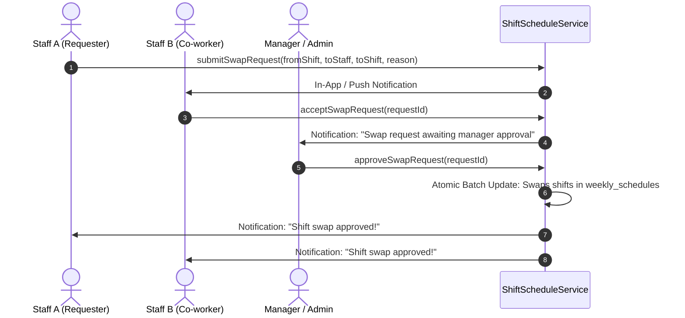

# Shift Scheduling & Attendance Integration Specifications

## 1. Overview & Business Requirements
The Employee Shift Scheduling system allows Gym Management (Admins & Managers) to define standard & custom work shifts, assign weekly schedules (Sunday to Saturday) across employees, enforce labor compliance (minimum 1 day off), prevent retroactive modification of past schedules, enable peer shift-swaps with management approval, and automatically duplicate weekly schedules every Saturday at 7:00 PM (Manila Time).

---

## 2. Shift Definitions & Timing Rules
Shifts are configurable via a dedicated management drawer/modal.

### Standard Shift Types
| Shift ID | Name | Time Window (24h) | Time Window (12h) | Required Hours | Type | Color Tag |
| :--- | :--- | :---: | :---: | :---: | :---: | :---: |
| `opening` | **Opening Shift** | 06:00 – 13:00 | 6:00 AM – 1:00 PM | 7 Hours | Fixed | 🟡 Amber |
| `morning` | **Morning Shift** | 08:00 – 15:00 | 8:00 AM – 3:00 PM | 7 Hours | Fixed | 🔵 Sky Blue |
| `night` | **Night / Closing Shift** | 15:00 – 22:00 | 3:00 PM – 10:00 PM | 7 Hours | Fixed | 🟣 Purple |
| `flexible` | **Flexible Shift** | Flexible | Flexible | 7 Hours | Flexible | 🟢 Emerald |
| `custom_*` | **Custom Shift** | User Defined | User Defined | Configurable | Fixed | 🔘 Slate |

---

## 3. Data Models (`src/app/core/models/shift-schedule.model.ts`)

```typescript
export interface ShiftDefinition {
    id: string;
    name: string;
    startTime: string; // '06:00' or 'Flexible'
    endTime: string;   // '13:00' or 'Flexible'
    requiredHours: number;
    isFlexible?: boolean;
    colorHex?: string;
    isActive: boolean;
    createdAt?: Date | any;
    updatedAt?: Date | any;
}

export interface DayShiftAssignment {
    shiftId: string;       // e.g. 'opening', 'night', 'flexible', or 'OFF'
    shiftName: string;
    startTime: string;
    endTime: string;
    isFlexible?: boolean;
    colorHex?: string;
    notes?: string;
}

export interface StaffWeeklyAssignment {
    staffId: string;
    staffName: string;
    roles: string[];
    days: {
        [dateStr: string]: DayShiftAssignment | null; // null = Unscheduled / Day Off
    };
    totalScheduledHours: number;
    daysScheduled: number;
    hasDayOff: boolean; // True if at least 1 day is null / OFF
}

export interface WeeklySchedule {
    id: string;             // Week ID: '2026-W35' or '2026-08-30_2026-09-05'
    startDate: string;      // '2026-08-30' (Sunday)
    endDate: string;        // '2026-09-05' (Saturday)
    status: 'PUBLISHED' | 'DRAFT';
    assignments: {
        [staffId: string]: StaffWeeklyAssignment;
    };
    createdBy: string;
    createdByName: string;
    createdAt: Date | any;
    updatedAt: Date | any;
}

export type ShiftSwapStatus = 'PENDING_PEER' | 'PENDING_MANAGER' | 'APPROVED' | 'REJECTED' | 'CANCELLED';

export interface ShiftSwapRequest {
    id: string;
    weekId: string;
    requesterId: string;
    requesterName: string;
    requesterDate: string;        // Date requester wants to swap out
    requesterShift: DayShiftAssignment;
    targetStaffId: string;
    targetStaffName: string;
    targetDate: string;           // Date of target shift
    targetShift: DayShiftAssignment;
    reason: string;
    status: ShiftSwapStatus;
    reviewedBy?: string;
    reviewedByName?: string;
    reviewedAt?: Date | any;
    rejectionReason?: string;
    createdAt: Date | any;
}
```

---

## 4. Key Workflows & Business Rules

### A. Weekly Schedule Lifecycle & Past Date Immutability
1. **Week Boundaries**: Always starts on **Sunday** and ends on **Saturday** (7 calendar days).
2. **Past Date Immutability**:
   - `dateStr < currentManilaDateStr()` $\rightarrow$ Cell is strictly locked (`🔒 Read-Only`).
   - Admins & Managers can only assign/modify shifts for **today and future dates**.
3. **Day-Off Rule**:
   - Labor compliance helper: displays a visual warning chip if an employee is assigned to all 7 days with 0 rest days.
   - Staff are not required to have a schedule (Unscheduled staff can still work on Flexible terms or as needed).

### B. Time & Attendance / Kiosk Auto-Binding
1. When staff member selects their account on the Kiosk or Attendance Terminal:
   - System fetches `weekly_schedules` for `todayDateStr`.
   - If scheduled $\rightarrow$ Kiosk automatically locks onto their assigned shift definition.
   - If unscheduled $\rightarrow$ Kiosk allows selecting Flexible / defaults to auto-detected shift.
2. Attendance evaluation (lateness, early arrival, scheduled start/end) derives from the daily schedule assignment.

### C. Saturday 7:00 PM Auto-Rollover (Firebase Cloud Function)
* Cloud Function: `functions.pubsub.schedule('0 19 * * 6').timeZone('Asia/Manila')`.
* On Saturday at 7:00 PM PH time:
  - Fetches the active weekly schedule ending today.
  - Computes next Sunday $\rightarrow$ next Saturday range.
  - If next week doesn't exist, clones current week's assignments into a new `PUBLISHED` schedule.
  - Sends a notification to Managers and Staff.

### D. Shift Swap Request Lifecycle


---

## 5. Responsive UI (4-Screen Layout Protocol)
1. 📱 **Mobile (< 640px) / Flip Phones**:
   - "My Upcoming Shifts" hero card.
   - 7-day pill selector (`[Sun] [Mon] [Tue] [Wed] [Thu] [Fri] [Sat]`) displaying the day's staff roster in full-width touch cards ($\ge 44\text{px}$).
   - Shift swap modal optimized for single-thumb mobile interaction.
2. 📱 **Tablet Portrait (640px – 768px)**:
   - Horizontally scrollable 7-day matrix table with `position: sticky; left: 0` frozen employee name column.
3. 💻 **Tablet Landscape / Small Laptop (769px – 1024px)**:
   - Full 7-column calendar grid with color-coded shift pills and daily staff headcount counters.
4. 🖥️ **Desktop & Wide Displays ($\ge 1280px$)**:
   - Full master matrix with shift creation modal, pending swap requests drawer, compliance badges, and PDF print preview.
