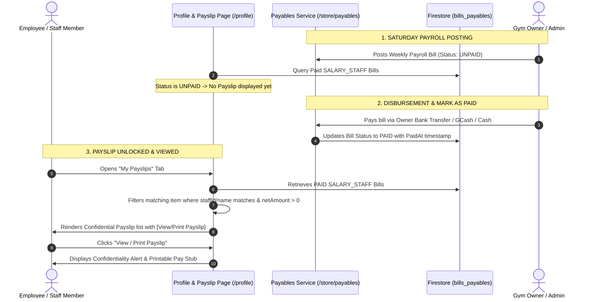

# User Profile, Document Repository, Confidential Weekly Payslips & 4-Screen Responsive Protocol

## 1. Executive Summary
This specification defines:
1. **Rich User Profile**: Personal details, emergency contacts, government identifiers (SSS, PhilHealth, Pag-IBIG, TIN), and employment/compensation data.
2. **Employee Document Repository**: Secure upload and management of identity cards (Valid IDs), employment contracts, and certifications supporting **Images (.jpg, .jpeg, .png, .webp) and PDF documents (.pdf)**.
3. **Confidential Weekly Payslips**: Automated generation and presentation of printable Sunday-to-Saturday weekly payslips triggered **only when the corresponding payroll bill has been marked PAID** in Bills & Accounts Payable (`/store/payables`). Zero-compensation users (e.g. Owner, business partners, or inactive staff) are excluded.
4. **Confidentiality & Compliance**: Prominent confidentiality notices safeguarding employee financial data.
5. **Mandatory 4-Screen Responsive UI Protocol**: Responsive CSS design rules for **Mobile (<640px)**, **Tablet Portrait (640-768px)**, **Tablet Landscape (769-1024px)**, and **Desktop (>1024px)** applied across `/staff-attendance`, `/profile`, and all new pages.

---

## 2. 📱 Mandatory 4-Screen Responsive Parameters

| Screen Tier | Viewport Breakpoint | Layout Strategy | Table / Matrix Behavior | Controls & Buttons |
| :--- | :--- | :--- | :--- | :--- |
| **1. Mobile** | `< 640px` | 1-Column vertical stack (`1fr`) | `overflow-x: auto` with `position: sticky; left: 0` for name columns | Full-width buttons (`100%`), touch targets `>= 44px` |
| **2. Tablet Portrait** | `640px – 768px` | 2-Column responsive grid | Condensed cell padding, scrollable matrix | Wrapped filter bars & icon buttons |
| **3. Tablet Landscape** | `769px – 1024px` | 2 to 3-Column layout | Semi-expanded matrix with horizontal swipe indicator | Side-by-side button groups |
| **4. Desktop & Wide** | `> 1024px` (`>= 1280px`) | 3 to 4-Column executive view | Full expanded matrix table up to `1400px` container | Side-by-side action toolbars & sticky side panels |

---

## 3. Data Models

### 3.1. Extended User Schema (`src/app/core/models/user.model.ts`)
```typescript
export interface EmployeeDocument {
  id: string;
  name: string;             // File name, e.g. "Gov_ID_Passport.jpg"
  fileType: 'IMAGE' | 'PDF';
  mimeType: string;
  category: 'GOVERNMENT_ID' | 'CONTRACT' | 'CERTIFICATION' | 'OTHER';
  downloadUrl: string;
  storagePath?: string;
  sizeBytes?: number;
  uploadedAt: Date;
  uploadedBy: string;
}

export interface UserEmergencyContact {
  name?: string;
  relationship?: string;
  phone?: string;
}

export interface UserGovernmentIds {
  sssNumber?: string;
  philHealthNumber?: string;
  pagIbigNumber?: string;
  tinNumber?: string;
}

export interface UserEmploymentDetails {
  jobTitle?: string;
  employmentType?: 'FULL_TIME' | 'PART_TIME' | 'CONTRACT' | 'COMMISSION_ONLY';
  hireDate?: Date;
  defaultShift?: string;
  bankName?: string;
  bankAccountName?: string;
  bankAccountNumber?: string;
  gcashNumber?: string;
  hourlyRate?: number;
  dailyRate?: number;
  monthlyTarget?: number;
}

export interface User {
  uid: string;
  email: string;
  displayName: string;
  roles: string[];
  photoURL?: string;
  createdAt?: Date;
  lastLoginAt?: Date;
  phone?: string;
  address?: string;
  isActive?: boolean;
  monthlyTarget?: number;
  dailySalaryRate?: number;
  
  // Extended fields
  birthDate?: Date;
  gender?: 'MALE' | 'FEMALE' | 'OTHER' | 'PREFER_NOT_TO_SAY';
  emergencyContact?: UserEmergencyContact;
  governmentIds?: UserGovernmentIds;
  employmentDetails?: UserEmploymentDetails;
  documents?: EmployeeDocument[];
}
```

---

## 4. Weekly Payslip Lifecycle & Paid Validation



---

## 5. Payslip Layout & Confidentiality Guard
* **Confidentiality Alert**:
  > 🔒 **Confidentiality Notice**: *This payslip contains strictly confidential compensation and personal financial information. It is intended solely for the designated employee. Unauthorized viewing, sharing, copying, or distribution to other employees or third parties is strictly prohibited.*
* **Printable Pay Stub Elements**:
  * **Header**: Epicenter Gym Management & Fitness Center (Logo, Address, Contact)
  * **Employee Info**: Full Name, Job Title, Role, Employee ID, Sunday–Saturday Period, Date Paid, Payment Method & Reference.
  * **Earnings Breakdown**: Gross Base Pay (Days worked), Overtime, Bonuses, Commissions.
  * **Deductions Breakdown**: Vale (Cash Advances) with shift drawer notes, Deficits/Adjustments.
  * **Net Pay**: Prominently emphasized final payout.
  * **Signatures**: Authorized Management Signatory placeholder.
  * **Print Media Styling**: Clean, high-resolution single-page format for direct PDF printing.
