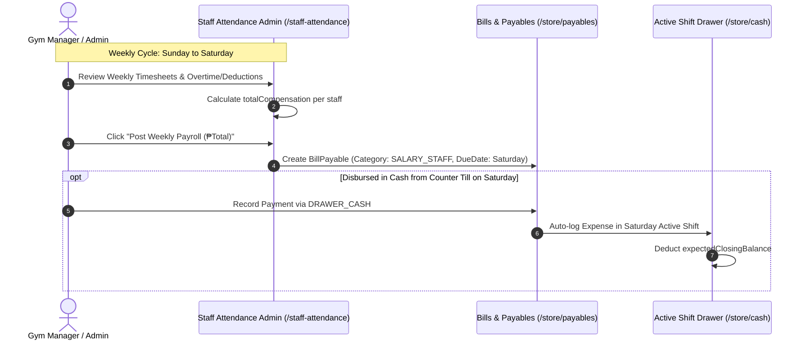

# Weekly Saturday Payroll, Procurement Bridge & Monthly Reporting Specification

## 1. Executive Summary
This document defines the operational bridges between:
1. **Weekly Saturday Staff Payroll** (Sunday-to-Saturday attendance cycle with Saturday disbursement).
2. **Purchase Requests & Stock Take Reorders** (Low-stock auto-drafting and supplier payable generation).
3. **Monthly Financial Cutoff & Executive Reporting** (Consolidating 4–5 Saturday payrolls, monthly utilities, and POS revenues into an official P&L summary).

---

## 2. Weekly Saturday Payroll Bridge Architecture

---

## 3. Stock Take to Purchase Request Bridge

1. **Stock Take Deficit Detection**:
   * In `/store/stock-take`, products with `systemStock <= minStockLevel` or audited deficits are flagged.
   * Action: **"Draft Restock PR from Deficits"** auto-fills a `PurchaseRequest` with deficit quantities.
2. **Approved PR to Accounts Payable**:
   * When a PR is approved with supplier credit terms (e.g. WheyKing 30-day term), it creates a payable bill in `/store/payables` under `PURCHASE_INVENTORY`.

---

## 4. Monthly Cutoff & Executive Reporting

### 4.1. Monthly Period Aggregation Formula
* **Calendar Month Inflow**: All validated transactions between Day 1 00:00 and End of Month 23:59.
* **Calendar Month Outflows**:
  * **Weekly Payroll**: Sum of all Saturday payroll bills paid within the month (typically 4 or 5 Saturdays).
  * **Monthly Utilities**: Electricity (Meralco), Water, and Telco bills for that billing period.
  * **Store Restock / COGS**: Purchases received in that month.
  * **Operational OPEX**: Daily supplies, gym repairs, and drinking water refills.
* **Net Operating Profit**:
  $$\text{Net Profit} = \text{Monthly Inflow} - (\text{Weekly Payrolls} + \text{Utilities} + \text{COGS} + \text{OPEX})$$

### 4.2. Printable / PDF Executive Summary Format
* Executive dashboard includes a **"Print / Export Monthly Summary"** view with clean tabular formatting for owner review.
